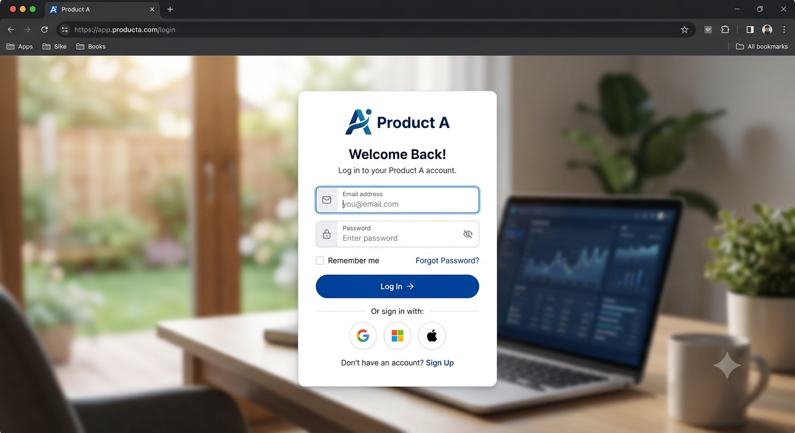

# Product A Installation

A start up guide for installing Product A Version 2.

## Linux System Requirements

* Minimum 8GB RAM
* Storage with minimum 32GB storage
* User with sudo permissions

## Software Requirements

* Docker version 22.0 - please refer to the official Docker documentation for installation details
* Docker-Compose version 2.22 - please refer to the official Docker documentation for installation details

## Deployment package details

* The deployment package follows the naming convention product-a-.tar.gz
* The package contains:
  * Docker Compose files that defines the following services:
    * `python-frontend` : Front end container
    * `python-backend` : Back end container
    * `postgresql-12` : Database for the application
    * `postgresql-init` : Runs setup scripts on Postgres during initialisation
    * `traefik` : Manages networking in the deployment package
  * An environments variable file (`.env`) used to set variables for the deployment
  * A `product-a.sh` script, a wrapper script to start, stop and Docker containers in the package

## Assumptions

* The user has already placed the deployment package onto the server.
* A license key has already been provided by the Product A team.
* In the steps below, `vi` is used to edit configuration for the document, but any text editor (e.g. `nano`) can also be used.
* The user has already logged into the server as the sudo user.

## Steps

1. Untar the deployment package, selecting `/opt` as the target folder:

```
tar -xvf product-a-<version>.tar.gz -C /opt
```

All Product A artefacts will now be available in the `/opt/product-a` folder.

2. Set the provided License Key; open the `.env` file for editing:

```
vi /opt/product-a/.env
```

3. Set the license key variable.

```
LICENCE_KEY=<provided license key>
```

4. (Optional) With the .`env` file still open, set PostgreSQL variables to point to an external PostgreSQL 12 instance. When `SET_EXTERNAL_POSTGRESQL` is set to true, all `POSTGRES_*` variables must be set to point to the external PostgreSQL database. Ensure that the username and password has read and write permissions for the external database:

```
SET_EXTERNAL_POSTGRESQL= true		      # default: false
POSTGRESQL_URL=https://postgres-server-1  # default: postgres
POSTGRESQL_PORT=5454				      # default: 5432
POSTGRESQL_USER =read-write-user  		  # default: dflt-user	
POSTGRESQL_PW=dummy				          # default: dflt-pw
POSTGRESQL_SCHEMA_NAME=public		      # default: public
```

5. Save the file:

```
:qa!
```

6. Run the start script:

```
./opt/product-a/product-a.sh
```

This script will bring up all services for Product A.&#x20;

If `SET_EXTERNAL_POSTGRESQL` has been set to true, the postgres container included in the deployment package will not be started, and the init script will attempt to run on the external PostgreSQL database.

## Post Installation

Check that the application is running by going onto your browser and typing:

```
https://<IP or DNS of the server>
```

The Product A login page should be appear:


