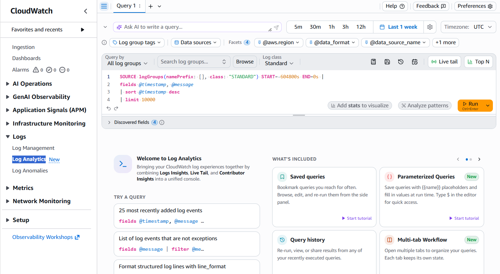
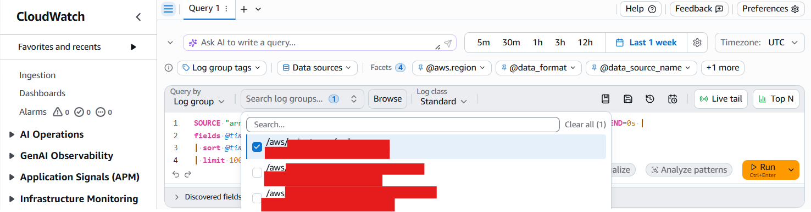

# Monitoring [Product Name] on AWS EKS using AWS CloudWatch

For product deployments running on AWS Elastic Kubernetes Service (EKS), the AWS CloudWatch service can be used to view ingested logs from the product. This service benfits from features such as:

* Steaming Logs in real time
* Search and Filter incoming logs
* Customisable Log Retention

Using Log Analytics, log queries can be used to find failures or logs from specific jobs, and can be exported during the debugging process. This document covers how to use AWS CloudWatch Log Analytics, and common log queries that can be modified for more specific use cases.

## Prerequisites

The AWS EKS cluster must be configured to send metrics and logs to AWS CloudWatch. A quick start guide is available on the AWS documentation site: [Monitor cluster data with Amazon CloudWatch](https://docs.aws.amazon.com/eks/latest/userguide/cloudwatch.html).

## Querying Logs

Naviagte to the AWS console and go to the CloudWatch service. Under Logs, cick on Log Analytics. This will open a page containing a query editor:



Setup the log queries. Click on the log groups and set the log group name to `/aws/containerinsights/[cluster name]/application`. Note: Cluster name can be found by going to the EKS service and looking at the current avaialable clusters.



The default query will return all logs in that log group within the default time frame (the last 1 hour).

## Common Log Queries

### Get logs from a specific container name

```
fields @timestamp, kubernetes.container_name, kubernetes.namespace_name, @message
| filter kubernetes.namespace_name = "[namespace]" and kubernetes.container_name = "[container name]"
| sort @timestamp desc
| display @timestamp, @message
```

### Filtering for specific log patterns

Regex can be used to search for partial log matches. This is useful for use cases such as:
* Filtering by Log Level.
* Finding groups of logs with specific thread/job IDs.
* Looking for patterns indicating the start and end messages of processes.

```
fields @timestamp, kubernetes.container_name, kubernetes.namespace_name, @message
| filter kubernetes.namespace_name = "[namespace]" and kubernetes.container_name = "[container name]"
| filter @message like /[LOG PATTERN]/
| sort @timestamp desc
| display @timestamp, @message
```
